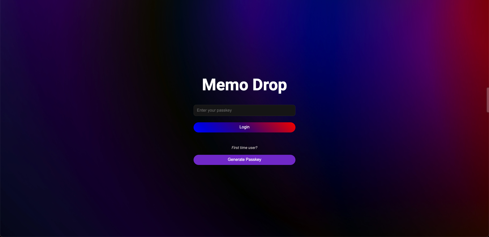
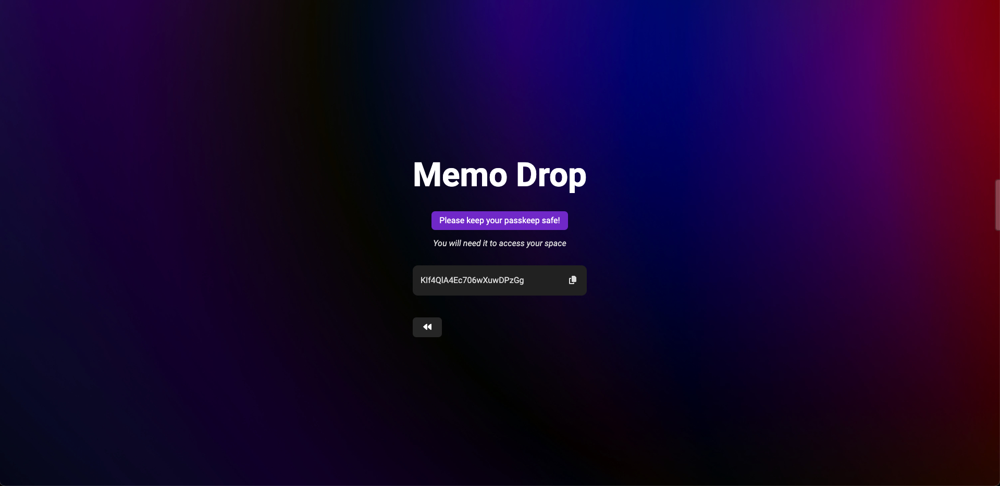
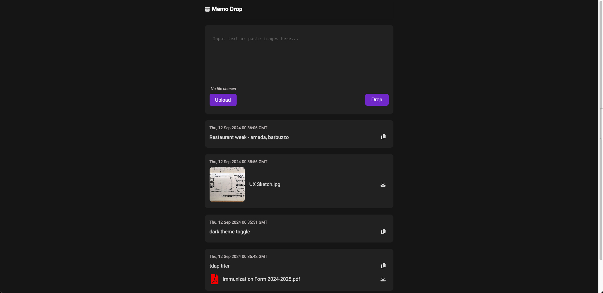

# MemoDrop

MemoDrop is a secure note-taking web app that allows users to create, manage, and retrieve notes and files easily. With a focus on simplicity and security, MemoDrop ensures that your data is accessible only with a secure passkey.

## Features

- **Secure Notes**: Save text notes securely.
- **File Uploads**: Upload and store files alongside your notes.
- **Passkey Access**: Generate a unique passkey to access your notes and files.
- **Cross-device Sync**: Access your notes and files from any device by entering your passkey.
- **Modern UI**: A simple, intuitive interface for easy navigation, optimized for both desktop and mobile devices.

## Live Demo

The frontend of the app is hosted on Netlify and can be accessed at:

[**MemoDrop Live**](https://memodrop.net)

## Backend Architecture

The backend is hosted on an EC2 instance, using Flask as the web framework and Nginx as the reverse proxy server. SSL certificates are provided by Let's Encrypt to ensure secure communication between the frontend and backend. The entire backend is containerized using Docker, ensuring consistent deployment and scalability.

- Backend API Base URL: `https://api.memodrop.net`

## Screenshots

### Login Page

### Passkey Generating Page

### Dashboard Page - Sample

## How to Use

1. **Generate a Passkey**:  
   On the login page, if you're a first-time user, click "Generate Passkey" to generate a unique passkey.
   
2. **Log in with Passkey**:  
   Enter the passkey on the login page to access your personal space.
   
3. **Create Notes**:  
   Once logged in, you can create text notes or upload files.
   
4. **Manage Notes and Files**:  
   View, copy, or download your notes and files from the dashboard.

## Technical Stack

- **Frontend**:  
   Built with [React](https://reactjs.org/) and deployed on [Netlify](https://www.netlify.com/).
   
- **Backend**:  
   The backend is powered by [Flask](https://flask.palletsprojects.com/), hosted on an AWS EC2 instance and containerized by Docker
   Nginx is used as the web server to handle the proxy requests between the frontend and backend, with SSL enabled via [Let's Encrypt](https://letsencrypt.org/).

- **Database**:  
   The app uses [MongoDB Atlas](https://www.mongodb.com/cloud/atlas) to store user notes and files. The connection between Flask and MongoDB is handled using [pymongo](https://pymongo.readthedocs.io/en/stable/).

- **File Storage**:  
   Files uploaded by users are stored in an **AWS S3 bucket** to ensure scalable and durable storage. The Flask backend handles file uploads and links them with user data in MongoDB.
